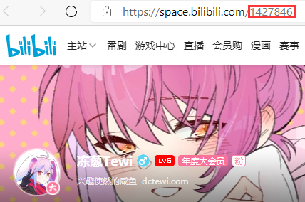

# 舰长信箱使用文档 v1.0

本文档是 舰长信箱（Member Mailbox）的使用文档，适用的版本为 v1.0。

本软件由 dctewi@dctewi.com 编写，遵守 MIT 协议。

## 界面介绍

**UID**：用来填写发送信息账号的用户ID（获取方法见下文）。

**Cookie**：用来填写登录用的Cookie字符串（获取方法见下文）。

**测试连通性**：用来测试以上两个内容填写是否正确，发送信息前必须通过测试。

**信息内容**：用来填写要发送的具体信息，支持换行。要发送表情，请使用B站表情文字代码（如 [傲娇]，[给心心] ）。

**发送**：用来发送消息。点击后会检查用户信息，请确认后选择“是”。

## 信息获取

### UID

进入你的B站个人主页，此时网址栏斜杠后方的数字就是你的UID（下图红框所示）。

注意，有时数字后会带有以问号开头的一系列参数，请只选择问号前的内容。

### Cookie

请遵循以下步骤：

1. 登录你的账号。

2. 访问 https://space.bilibili.com/

3. 右键界面，选择 “检查” 或者 “审查元素” 等（取决于不同的浏览器），会打开一个 DevTools 窗口：

    

4. 选择 “网络” 或者 “Network” 页。

5. 保持 DevTools 打开，刷新界面。

6. 此时，Network 中会显示出很多网络请求，随意选择一项。

7. 在右边的详细信息里查找 “请求标头” 或者 “Request Header” 部分，找到其中的 “cookie”，直接复制全部内容（蓝色部分）：

    

8. 复制部分直接复制进Cookie栏即可。